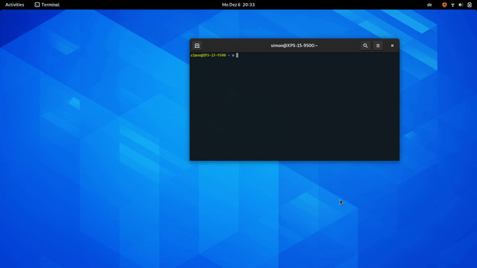

  

# Desktop Cube for GNOME Shell

When I started using Linux more than a decade ago, it was because of the 3D desktop cube of Compiz.

## :construction: This is under Construction!

Here's a rough list of thing which might be added in the future, roughly sorted by importance:

- [ ] Support for GNOME Shell 41.
- [ ] Better transitions. I would like to improve the impression of "folding".
- [ ] Free rotation of the cube with the middle mouse button.
- [ ] A settings dialog. The opacity of the workspaces, their spacing, and several other things could be configurable.
- [ ] Proper support for multiple monitors (it may work already, I just haven't tested it).
- [ ] Automated CI tests.
- [ ] Cuboid transitions when switching workspaces via <kbd>Ctrl</kbd>+<kbd>Alt</kbd>+<kbd>Arrow</kbd>.

## :exploding_head: Frequently asked Questions

#### Does this extension increase my productivity?

No.

#### Does this extension increase the performance of GNOME Shell?

Certainly not. But the impact is not so bad after all.

#### Will this extension break if GNOME Shell is updated?

Most likely. The implementation is pretty hacky and relies on some specific internals of GNOME Shell. But maybe we will be able to keep it running....

#### The workspaces are not really arranged in a cuboid fashion. Should we change the name of the extension?

That's a smart point! However, covering only 180°, ensures that no one notices that we cannot rotate the "cube" for an entire round...

## :octocat: I want to contribute!

That's great!
Here are some basic rulles to get you started:
Commits should start with a Capital letter and should be written in present tense (e.g. __:tada: Add cool new feature__ instead of __:tada: Added cool new feature__).
You should also start your commit message with **one** applicable emoji.
This does not only look great but also makes you rethink what to add to a commit. Make many but small commits!

Emoji | Description
------|------------
:tada: `:tada:` | When you added a cool new feature.
:wrench: `:wrench:` | When you added a piece of code.
:recycle: `:recycle:` | When you refactored a part of the code.
:sparkles: `:sparkles:` | When you applied clang-format.
:globe_with_meridians: `:globe_with_meridians:` | When you worked on translations.
:art: `:art:` | When you improved / added assets like themes.
:lipstick: `:lipstick:` | When you worked on the UI of the preferences dialog.
:rocket: `:rocket:` | When you improved performance.
:memo: `:memo:` | When you wrote documentation.
:beetle: `:beetle:` | When you fixed a bug.
:revolving_hearts: `:revolving_hearts:` | When a new sponsor is added or credits are updated.
:heavy_check_mark: `:heavy_check_mark:` | When you worked on checks or adjusted the code to be compliant with them.
:twisted_rightwards_arrows: `:twisted_rightwards_arrows:` | When you merged a branch.
:fire: `:fire:` | When you removed something.
:truck: `:truck:` | When you moved / renamed something.