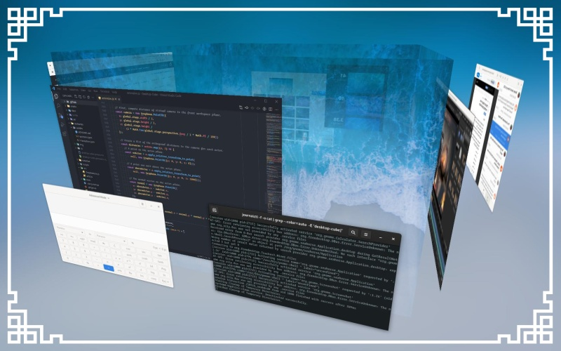
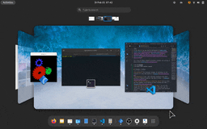
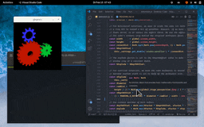
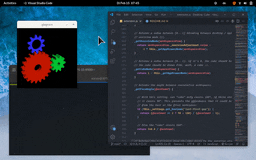
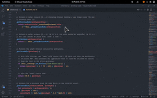
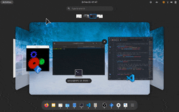
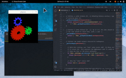
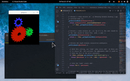
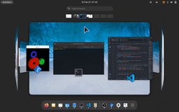

<p align="center">
  
</p>

<h1 align="center">A Desktop Cube for GNOME Shell</h1>

<p align="center">
  <a href="https://extensions.gnome.org/extension/4648/desktop-cube/"></a><br/>
  <a href="https://github.com/Schneegans/Desktop-Cube/actions"></a>
  <a href="LICENSE"></a>
  <a href="https://hosted.weblate.org/engage/desktop-cube/"></a>
  <a href="scripts/cloc.sh"></a>
  <a href="scripts/cloc.sh"></a>
</p>

When I started using Linux more than a decade ago, it was because of the 3D desktop cube of Compiz.
Even if this was a pretty useless feature, I am still missing it today.
Therefore, I decided to create a similar effect for GNOME Shell.
If you like it, you may also be interested in other nostalgic extensions, such as [Compiz-alike windows effects](https://extensions.gnome.org/extension/2950/compiz-alike-windows-effect/), or [Burn-My-Windows](https://extensions.gnome.org/extension/4679/burn-my-windows/)!

For a list of things changed in previous releases, you can have a look at the [changelog](docs/changelog.md)!

## 🎉 Features

 <br> **3D Overview:** The extension arranges the workspaces in the overview in a cube-like fashion. |  <br> **3D Workspaces:** Also, when switching workspaces with touch gestures or keyboard shortcuts, the cube is shown.
|:-:|:-:|
 <br> **Click and drag the desktop to rotate the cube:** You can click and drag anywhere on the desktop to start rotating the cube! |  <br> **Click and drag the panel to rotate the cube:** You can also trigger the cube by dragging on the panel. This is useful with maximized windows. 
 <br> **Click and drag the overview to rotate the cube:** You can also click and drag the overview's background to rotate the cube. |  <br> **Explode the cube on vertical rotations:** If you rotate the cube up or down, the 3D effect will become more intense.
 <br> **Smooth transitions between Desktop, Overview, and App Drawer:** If you enter the app-drawer mode, the cube will be unfolded. |  <br> **Dynamic workspaces:** The extension supports any number of workspaces. So it's actually not a cube most of the time...

## 🪲 Limitations

Issues are tracked [here on GitHub](https://github.com/Schneegans/Desktop-Cube/issues). There are currently two main known limitations:
* **No wrap-around:** In GNOME Shell, it is not possible to change from the last to the first workspace. The Desktop-Cube extension does not change this.
* **Bad multi-monitor support:** GNOME Shell uses one central perspective for all monitors combined. Therefore, the cube looks somewhat sheared on setups with multiple monitors.


## 💞 These People _love_ this Extension

While coding new features is the most awesome way to contribute, providing financial support will help me stay motivated to invest my spare time to keep the project alive in the future.

<h3 align="center">🥇 Current Gold Sponsors</h3>
<p align="center">
<a href="https://github.com/dennis1248">Dennis ten Hoove</a><br>
</p>

<h3 align="center">🥈 Current Silver Sponsors</h3>
<p align="center">
  <a href="https://twitter.com/tjiiik">tj3k</a><br>
  <a href="https://github.com/castrojo">Jorge Castro</a>
</p>

<h3 align="center">🥉 Current Bronze Sponsors</h3>
<p align="center">
  <a href="https://github.com/sponsors/Schneegans">Be the first!</a>
</p>

<!--
<h3 align="center">🏅 Previous Sponsors and One-Time Donators</h3>
<p align="center">
</p>
-->

Do you want to show that you love it too? You may <a href="https://github.com/sponsors/Schneegans">become a sponsor for as little as 1$ / month</a>!
If you like this extension, you may also want to try one of my other extensions: [🔥 Burn-My-Windows](https://github.com/Schneegans/Burn-My-Windows) or [🍰 Fly-Pie](https://github.com/Schneegans/Fly-Pie/)!

## ⬇️ Installation

You can either install the Desktop Cube extension from extensions.gnome.org (a), download a stable release
from GitHub (b) or clone the latest version directly with `git` (c).

### a) Installing from extensions.gnome.org

This is the easiest way to install the Desktop Cube extension. Just head over to
[extensions.gnome.org](https://extensions.gnome.org/extension/4648/desktop-cube) and flip the switch!
If you want to use a more up-to-date version, you can try one of the methods listed below.

### b) Downloading a Stable Release

Execute this command to download the latest stable release:

```bash
wget https://github.com/Schneegans/Desktop-Cube/releases/latest/download/desktop-cube@schneegans.github.com.zip
```

Install it by executing the following command. If you have the Desktop Cube extension already installed and want to upgrade to
the latest version, append the `--force` flag in order to overwrite existing installs of the Desktop Cube extension.

```bash
gnome-extensions install desktop-cube@schneegans.github.com.zip
```

Then restart GNOME Shell with <kbd>Alt</kbd> + <kbd>F2</kbd>, <kbd>r</kbd> + <kbd>Enter</kbd>.
Or logout / login if you are on Wayland.
Then you can enable the extension with the *Gnome Tweak Tool*, the *Extensions* application or with this command:

```bash
gnome-extensions enable desktop-cube@schneegans.github.com
```

### c) Cloning the Latest Version with `git`

You should **not** clone the Desktop Cube extension directly to the `~/.local/share/gnome-shell/extensions` directory as this may get overridden occasionally!
Execute the clone command below where you want to have the source code of the extension.

```bash
git clone https://github.com/Schneegans/Desktop-Cube.git
cd Desktop-Cube
```

Now you will have to install the extension.
The `make` command below compiles the locales, schemas and resources, creates a zip file of the extension and finally installs it with the `gnome-extensions` tool.

```bash
make install
```

Then restart GNOME Shell with <kbd>Alt</kbd> + <kbd>F2</kbd>, <kbd>r</kbd> + <kbd>Enter</kbd>.
Or logout / login if you are on Wayland.
Then you can enable the extension with the *Gnome Tweak Tool*, the *Extensions* application or with this command:

```bash
gnome-extensions enable desktop-cube@schneegans.github.com
```

## :octocat: I want to contribute!

That's great!
Here are some basic rulles to get you started:
Commits should start with a Capital letter and should be written in present tense (e.g. __:tada: Add cool new feature__ instead of __:tada: Added cool new feature__).
You should also start your commit message with **one** applicable emoji.
This does not only look great but also makes you rethink what to add to a commit. Make many but small commits!

Emoji | Description
------|------------
:tada: `:tada:` | When you added a cool new feature.
:wrench: `:wrench:` | When you added a piece of code.
:recycle: `:recycle:` | When you refactored a part of the code.
:sparkles: `:sparkles:` | When you applied clang-format.
:globe_with_meridians: `:globe_with_meridians:` | When you worked on translations.
:art: `:art:` | When you improved / added assets like themes.
:lipstick: `:lipstick:` | When you worked on the UI of the preferences dialog.
:rocket: `:rocket:` | When you improved performance.
:memo: `:memo:` | When you wrote documentation.
:beetle: `:beetle:` | When you fixed a bug.
:revolving_hearts: `:revolving_hearts:` | When a new sponsor is added or credits are updated.
:heavy_check_mark: `:heavy_check_mark:` | When you worked on checks or adjusted the code to be compliant with them.
:twisted_rightwards_arrows: `:twisted_rightwards_arrows:` | When you merged a branch.
:fire: `:fire:` | When you removed something.
:truck: `:truck:` | When you moved / renamed something.