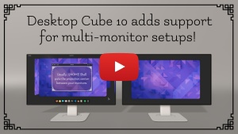

<!--
SPDX-FileCopyrightText: Simon Schneegans <code@simonschneegans.de>
SPDX-License-Identifier: CC-BY-4.0
-->

# Changelog of the Desktop Cube Extension

## [Desktop Cube 20](https://github.com/schneegans/Desktop-Cube/releases/tag/v20)

**Release Date:** 2023-10-07

#### Enhancements

- Instead of an always out-of-date list of sponsors, the main menu of the preferences dialog now contains a link to the new [list of all donors](https://schneegans.github.io/sponsors/). This list is semi-automatically updated whenever a new donation is received. Thanks to all the donors!

#### Bug Fixes

- Fixed an issue which caused overly ambitious workspace transitions when dragging the cube with the mouse.

## [Desktop Cube 19](https://github.com/schneegans/Desktop-Cube/releases/tag/v19)

**Release Date:** 2023-09-14

#### Bug Fixes

- Removed some old code from pre 45 times which caused an error message during workspace switches.

## [Desktop Cube 18](https://github.com/schneegans/Desktop-Cube/releases/tag/v18)

**Release Date:** 2023-09-09

#### Major Changes

- This is the first release of the Desktop-Cube supporting GNOME 45. This required a [major refactoring](https://github.com/Schneegans/Desktop-Cube/pull/132/files) of the code base as GJS now uses ESM modules. As a consequence, this version is not compatible with older versions of GNOME Shell anymore. The old code base is still available on the `gnome-42-44` branch and if new features are added (especially translations), they can be backported to this branch.
- With GNOME 45, it is not possible anymore to override the UI animation durations. Therefore, the following settings had to be removed:
  - Transition time from desktop to overview.
  - Transition time from overview to app drawer.
  - Transition time between workspaces.
- The Skybox now uses `Clutter.Effect` instead of `Shell.GLSLEffect` as a base class. This should improve the performance slightly, as it does not require painting to an offscreen buffer any more.

## [Desktop Cube 17](https://github.com/schneegans/Desktop-Cube/releases/tag/v17)

**Release Date:** 2023-06-09

#### Enhancements

- https://www.paypal.me/simonschneegans is now the default donation link for PayPal.

## [Desktop Cube 16](https://github.com/schneegans/Desktop-Cube/releases/tag/v16)

**Release Date:** 2023-06-09

#### Enhancements

- Added support for the new donation button on extensions.gnome.org.
- The background panorama is now loaded asynchronously.
- Translation updates, including a completely new Polish translation! Thanks to all the translators!

## [Desktop Cube 15](https://github.com/schneegans/Desktop-Cube/releases/tag/v15)

**Release Date:** 2023-03-12

#### Enhancements

- **New donation method: Ko-fi**. Follow me on Ko-fi to get the latest updates regarding my extensions: https://ko-fi.com/schneegans!
- On X11 multi-monitor setups, the cube's perspective is now corrected for the _current_ monitor (rather than the _primary_ monitor). Thanks to [@G-dH](https://github.com/G-dH) for the suggestion!
- Translation updates, including a completely new Finnish translation! Thanks to all the translators!

## [Desktop Cube 14](https://github.com/schneegans/Desktop-Cube/releases/tag/v14)

**Release Date:** 2023-02-26

#### Enhancements

- Added support for GNOME 44.
- The settings dialog now uses widgets from `libadwaita`. Hence, this update is only available for GNOME 42, 43 and 44.
- Many new translations! There are completely new Czech, Japanese, and Swedish translations and many other translations received updates. Thanks to all the translators!

## [Desktop Cube 13](https://github.com/schneegans/Desktop-Cube/releases/tag/v13)

**Release Date:** 2022-10-09

#### New Features

- It is now possible to configure the cube rotation speed when dragging with the mouse. You can find the new "Mouse Rotation Speed" in the general settings of the extension.

#### Other Enhancements

- When rotating the cube outside the overview, the rotation is not limited to the adjacent workspaces any more. You can also 'flick' the cube to rotate by multiple workspaces at once!
- The default sensitivity for drag rotations has been increased. It is now easier to rotate to workspaces which are farther away.
- The Desktop-Cube now follows the [REUSE Specification](https://reuse.software/spec).

## [Desktop Cube 12](https://github.com/schneegans/Desktop-Cube/releases/tag/v12)

**Release Date:** 2022-09-14

#### New Features

- Added support for GNOME 43.

#### Other Changes

- Many new translations! There are completely new Slovak and Galician translations and many other translations received updates. Thanks to all the translators!

## [Desktop Cube 11](https://github.com/schneegans/Desktop-Cube/releases/tag/v11)

**Release Date:** 2022-08-18

#### Bug Fixes

- Fixed an issue which made the default hot corners of GNOME Shell difficult to activate. Thank you, [msizanoen1 for this fix](https://github.com/Schneegans/Desktop-Cube/pull/75)!

#### New Features

- It is now possible to adjust the required mouse pressure for switching workspaces when moving windows against the workspace edges.

#### Other Changes

- The required pressure for switching workspaces when moving windows against the workspace edges has been increased (now 200, previously 100).

## [Desktop Cube 10](https://github.com/schneegans/Desktop-Cube/releases/tag/v10)

**Release Date:** 2022-04-29

#### New Features

- **Multi-Monitor Perspective Fixes:** The extension now tweaks the projection and view matrices used during rendering by GNOME Shell so that the projection center of the virtual camera is in front of the primary monitor. On Wayland, it can even use different matrices for each monitor. Therefore, even multiple desktop cubes will look good on Wayland. The only configuration which still looks bad is multiple desktop cubes on X11. This feature can be disabled as it may negatively affect the performance as frustum culling needs to be disabled for this to work...

#### Other Changes

- Many new translations! There are completely new Catalonian and Russian translations and the Italian, Turkish and Spanish translations received updates. Thanks to all the translators!
- The extension now uses a new version of the [Dynamic Badges Action](https://github.com/Schneegans/dynamic-badges-action) to generate the lines-of-code badges for the README.md.
- All links to the overridden methods of GNOME Shell in the source code of the extension have been updated.

#### Bug Fixes

- Fixed a bug which caused any secondary monitor to flicker during workspace switches if a background panorama was used.
- Fixed a bug which triggered workspace switches when the mouse pointer hit the screen edges while the Alt-Tab window switcher was shown.
- There seem to be cases were `libadwaita` is not available on GNOME 42 (e.g. Pop!\_OS 22.04 beta). The preferences dialog now tries to fallback to the GTK4-only variant if `libadwaita` is not available.

## [Desktop Cube 9](https://github.com/schneegans/Desktop-Cube/releases/tag/v9)

**Release Date:** 2022-03-10

#### New Features

- **Skyboxes**: You can now set an image as background panorama! For best results, the image should be a 360° panorama in the equirectangular projection. A good source for such panoramas is [polyhaven.com/hdris](https://polyhaven.com/hdris). Be sure to download the tone-mapped JPEG versions!
- **Drag windows to adjacent workspaces**: You can now drag a window to the edge of your screen and with enough pressure, the cube will flip to the neighboring workspace! This works both, on the desktop and in the overview. There are two new switches in the preferences dialog to toggle these features.

#### Other Changes

- Removed the Liberapay donation option as it does not work properly.

## [Desktop Cube 8](https://github.com/schneegans/Desktop-Cube/releases/tag/v8)

**Release Date:** 2022-02-25

#### New Features

- It is now possible to **rotate the cube by single-click dragging**! This works in three places (all of them can be enabled or disabled in the settings):
  - In the **overview**: Click any non-interactive area (e.g. the background) and start dragging. You will be able to switch workspaces by horizontal movement, and you can look "into" the cube by rotating it up and down.
  - On the **desktop**: Simply click any free space on you desktop and start dragging the cube!
  - On the **panel**: Simply click on the panel and start dragging!
- **Cube Explosion**: If you rotate the cube vertically (both in desktop or overview mode), the cube will be scaled down and the depth separation between windows will be increased.
- **Depth Variance in Overview**: During rotations, window clones in the overview are not all drawn at the same depth.
- Proper **touch-screen support**: Rotating the cube works well on touch-screen devices. Especially the rotate-by-dragging-the-panel works very well in this case: Just slide a finger from the top edge of the screen and then rotate left and right!
- **Translations!** It is now possible to [translate the preferences dialog](https://hosted.weblate.org/engage/desktop-cube/). We already have those languages included (thanks to all the translators!):
  - Arabic
  - Dutch
  - English
  - French
  - German
  - Italian
  - Norwegian Bokmål
  - Spanish
- An **about-dialog** has been added which shows all translators and sponsors.
- Initial support for GNOME Shell 42. Please [report any bugs you find](https://github.com/Schneegans/Desktop-Cube/issues)!

#### Other Changes

- Removed the unfold-to-desktop option as we now have cuboid workspace transitions everywhere.
- **Added advanced CI tests:** For each commit to `main`, it is now tested whether the extension can be installed and if the preferences dialog can be shown on GNOME Shell 40 and 41. Both, X11 and Wayland are checked.
- The README now shows the current lines of code and the current comment percentage using my [dynamic-badges-action](https://github.com/Schneegans/dynamic-badges-action).
- Added [Liberapay](https://liberapay.com/Schneegans) to the sponsorship options.

#### Bug Fixes

- Fixed the workspace size in the overview. The active workspace should now be drawn at the same size as without the extension.
- Fixed some depth sorting issues. Especially when transitioning from window picker state to app drawer state, the windows were sometimes drawn behind the workspace backgrounds.
- Improved the performance of transition from overview to app-drawer.

## [Desktop Cube 7](https://github.com/schneegans/Desktop-Cube/releases/tag/v7)

**Release Date:** 2021-12-29

#### Bug Fixes

- Fixed cuboid desktop transitions when using touchpad gestures.

## [Desktop Cube 6](https://github.com/schneegans/Desktop-Cube/releases/tag/v6)

**Release Date:** 2021-12-29

#### New Features

- The transition between workspaces when switching in desktop mode now shows the "cube" as well.
- Added a menu to the preferences dialog with links for bug reporting and donations.

#### Other Enhancements

- The extension's version number is now shown in the title of the preferencs dialog.

#### Bug Fixes

- Fixed a non-critical warning about `-Infinity`.

## [Desktop Cube 5](https://github.com/schneegans/Desktop-Cube/releases/tag/v5)

**Release Date:** 2021-12-12

#### New Features

- A small settings dialog allows adjusting some settings regarding the cube's layout, appearance, and behavior.
- It's now possible re-enable the unfold-to-desktop animation.
- It's now possible to modify some animation times such as from desktop to overview, from overview to app drawer, and between workspaces.

## [Desktop Cube 4](https://github.com/schneegans/Desktop-Cube/releases/tag/v4)

**Release Date:** 2021-12-09

#### Enhancements

- The transition from desktop to overview does not fold / unfold the cube any more.
- Cube-face-position computations has been refactored. There are now constants in the code to reliably specify the gap between adjacent workspaces as well as to stretch the position of the next and previous workspace horizontally. This ensures that the side faces of a four-sided cube are visible from the front.
- This changelog has been added.

#### Bug Fixes

- Fixed overlapping workspaces if there are many workspaces.

## [Desktop Cube 3](https://github.com/schneegans/Desktop-Cube/releases/tag/v3)

**Release Date:** 2021-12-07

- Support for GNOME 41 has been added.

## [Desktop Cube 2](https://github.com/schneegans/Desktop-Cube/releases/tag/v2)

**Release Date:** 2021-12-07

- Re-licensed the code as GPLv3 as this is a requirement for invasive GNOME Shell extensions.

## [Desktop Cube 1](https://github.com/schneegans/Desktop-Cube/releases/tag/v1)

**Release Date:** 2021-12-07

- Initial publication on GitHub supporting GNOME 40.
